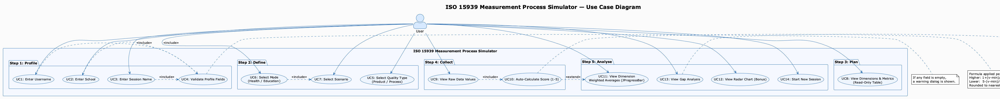
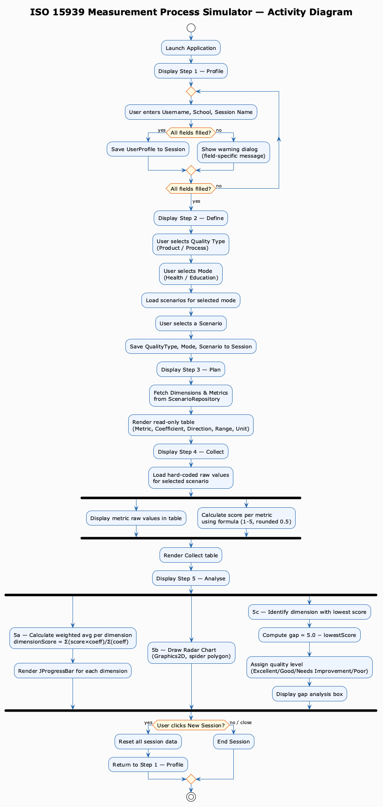
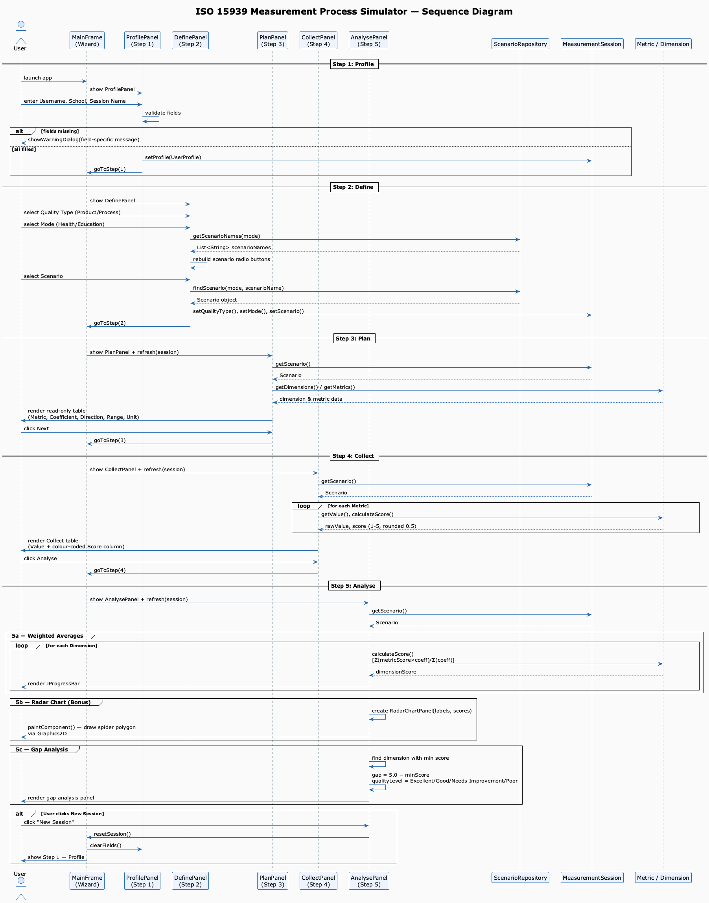

# ISO 15939 Measurement Process Simulator
## Requirements and Design Document

**Course:** Software Project II  
**Assignment:** Individual Project  
**Student Name:** [YİĞİT AHMET HOSTA]  
**Student ID:** [202328031]  
**Date:** May 2026

---

## 1. Introduction

This document presents the requirements analysis and design artifacts for the ISO 15939 Measurement Process Simulator — a Java Swing desktop application that simulates the five core steps of the ISO/IEC 15939 software measurement process standard.

---

## 2. Functional Requirements

| ID   | Requirement |
|------|-------------|
| FR1  | The system shall collect user profile information (username, school, session name) before starting a measurement session. |
| FR2  | The system shall validate that all profile fields are filled before proceeding; a user-friendly warning must be shown for each missing field. |
| FR3  | The system shall allow the user to select exactly one quality type (Product Quality / Process Quality). |
| FR4  | The system shall allow the user to select exactly one measurement mode (Health / Education). |
| FR5  | The system shall display at least two scenarios per mode; the user shall select exactly one scenario. |
| FR6  | The system shall display all dimensions and metrics for the selected scenario in a read-only table (Step 3). |
| FR7  | The system shall display hard-coded raw data values for each metric and automatically calculate a score between 1–5 (Step 4). |
| FR8  | Score calculation formula: Higher is better: `1 + (value − min) / (max − min) × 4`; Lower is better: `5 − (value − min) / (max − min) × 4`. Result clamped to [1.0, 5.0] and rounded to nearest 0.5. |
| FR9  | The system shall calculate and display dimension-level weighted averages using `Σ(metricScore × coeff) / Σ(coeff)` with a JProgressBar. |
| FR10 | The system shall draw a radar (spider) chart using Java 2D Graphics for all dimension scores (Bonus). |
| FR11 | The system shall identify the lowest-scoring dimension and display its name, score, gap (5.0 − score), quality level label, and a fixed improvement message. |
| FR12 | The system shall allow the user to start a new session from the Analyse screen, resetting all data. |
| FR13 | A step indicator at the top of the screen shall highlight the active step and show ✓ marks on completed steps. |

---

## 3. Non-Functional Requirements

| ID   | Requirement |
|------|-------------|
| NFR1 | The application must use Java SE 17 or higher with no external libraries. |
| NFR2 | The application must be compilable and runnable from the command line (`javac` / `java`). |
| NFR3 | The GUI must use Java Swing components (JFrame, JPanel, CardLayout, JRadioButton, JTable, JProgressBar, Graphics2D). |
| NFR4 | The codebase must follow the MVC pattern: model classes (data/logic) separated from view classes (GUI). |
| NFR5 | OOP principles must be applied: encapsulation (private fields + getters), inheritance (panel hierarchy), polymorphism (renderer overrides). |
| NFR6 | Collections Framework must be used: `ArrayList` and `HashMap` in ScenarioRepository. |
| NFR7 | The application window must be a minimum of 820×580 pixels and centered on screen. |

---

## 4. Use Case Diagram

The Use Case Diagram below shows all interactions between the **User** actor and the system across the five wizard steps.



### Key Use Cases

| Use Case | Description |
|----------|-------------|
| UC1–UC3  | Enter profile fields (username, school, session name) |
| UC4      | Validate profile fields — triggered on Next click |
| UC5      | Select quality type with mutual exclusivity (RadioButton) |
| UC6      | Select mode (Health / Education) |
| UC7      | Select scenario based on chosen mode |
| UC8      | View read-only dimension/metric table |
| UC9      | View raw data values per metric |
| UC10     | Auto-calculate 1–5 score using formula |
| UC11     | View weighted average per dimension (JProgressBar) |
| UC12     | View radar chart (Bonus) |
| UC13     | View gap analysis (worst dimension) |
| UC14     | Start a new session |

---

## 5. Activity Diagram

The Activity Diagram shows the complete workflow from application launch to session completion, including validation branches and parallel analysis rendering.



### Key Decision Points

- **Profile validation:** If any field is empty, a warning dialog is shown and the user is redirected to fill the missing field.
- **Mode selection:** Selecting a mode dynamically reloads the scenario list.
- **Score calculation:** Performed automatically for every metric when Step 4 is loaded.
- **New Session:** User can restart the wizard at any point from Step 5.

---

## 6. Sequence Diagram

The Sequence Diagram shows the object-level interactions between the User, UI panels, session model, and data repository across all five steps.



### Participant Responsibilities

| Participant | Role |
|-------------|------|
| MainFrame | Wizard controller — manages CardLayout navigation and session state |
| ProfilePanel | Collects and validates user profile (Step 1) |
| DefinePanel | Handles three-stage selection and populates session (Step 2) |
| PlanPanel | Fetches and renders read-only metric table (Step 3) |
| CollectPanel | Displays raw values and computed scores (Step 4) |
| AnalysePanel | Renders progress bars, radar chart, and gap analysis (Step 5) |
| ScenarioRepository | Central data store (HashMap of mode → List\<Scenario\>) |
| MeasurementSession | Shared session object passed through all steps |
| Metric / Dimension | Domain model with encapsulated score calculation logic |

---

## 7. Class Design Overview

```
Main
└── view.MainFrame (JFrame + CardLayout wizard)
    ├── view.StepIndicatorPanel     — top progress bar
    ├── view.ProfilePanel           — Step 1
    ├── view.DefinePanel            — Step 2
    ├── view.PlanPanel              — Step 3
    ├── view.CollectPanel           — Step 4
    ├── view.AnalysePanel           — Step 5
    │   └── view.RadarChartPanel    — Bonus: Graphics2D spider chart
    └── model.MeasurementSession    — shared wizard state
        ├── model.UserProfile
        ├── model.Scenario
        │   └── model.Dimension (List)
        │       └── model.Metric (List)
        └── model.ScenarioRepository (static HashMap)
```

---

## 8. Scenarios Defined

### Health Mode (Product Quality)
| Scenario | Dimensions |
|----------|-----------|
| Scenario A — Clinic Alpha | Performance, Security, Availability, Usability |
| Scenario B — Hospital Beta | Performance, Security, Availability, Usability |

### Education Mode (Product Quality)
| Scenario | Dimensions |
|----------|-----------|
| Scenario C — Team Alpha | Usability, Perf. Efficiency, Accessibility, Reliability, Func. Suitability |
| Scenario D — Team Beta | Usability, Perf. Efficiency, Accessibility, Reliability, Func. Suitability |

---

*End of Requirements and Design Document*
